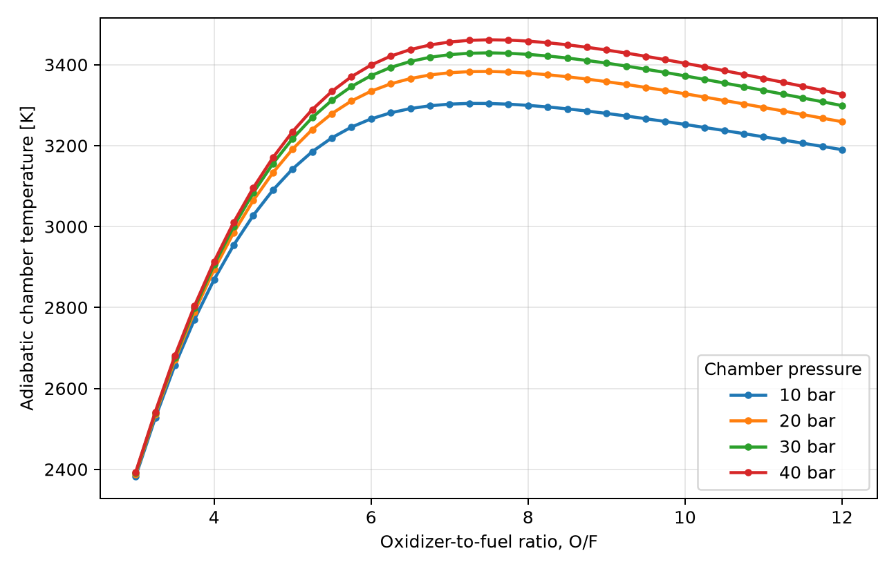

# Thermochemical Performance Study of a N2O/Paraffin Hybrid Rocket Motor

Project for **Computer Methods in Combustion / Metody komputerowe w spalaniu**.

The repository contains a Cantera-based preliminary analysis of a small hybrid
rocket motor using nitrous oxide as oxidizer and paraffin-like fuel. Because a
solid paraffin grain is not directly represented in the selected gas mechanism,
the fuel vapor is approximated with ethylene (`C2H4`), a practical surrogate for
gas-phase paraffin pyrolysis products available in `gri30.yaml`.

## Project Scope

The study evaluates:

- adiabatic equilibrium chamber temperature versus oxidizer-to-fuel ratio,
- influence of chamber pressure from 10 to 80 bar,
- equilibrium product composition at 20 bar,
- heat capacity ratio, molecular weight and selected transport properties,
- ideal characteristic velocity `c*`,
- ideal sea-level and vacuum specific impulse for a fixed nozzle area ratio,
- an illustrative hybrid port-regression time history.

The model is a preliminary thermochemical and internal-ballistics study. It is
not a CFD model and does not include injector physics, nozzle losses, heat
transfer, condensed phases, or detailed paraffin surface chemistry.

## Main Results

- Stoichiometric `O/F` for the `C2H4 + N2O` surrogate system is about `9.41`.
- The best `c*` in the 20 bar sweep occurs near `O/F = 5.25`.
- The maximum ideal vacuum `Isp` in the same sweep is about `290 s`.
- The maximum ideal sea-level `Isp` in the same sweep is about `164 s`.
- The simplified 8 s port model shifts `O/F` from about `5.54` to `6.45`.

Some equilibrium temperatures exceed 3000 K, so Cantera reports a warning about
the nominal thermodynamic-data range of the mechanism. The trends are useful for
course-level comparison, but the values should not be treated as design
certification data.

## Repository Layout

```text
.
├── data/processed/                 # Generated CSV results
├── figures/                        # Generated plots
├── report/
│   ├── report.pdf                  # Generated PDF report
│   └── report.tex                  # LaTeX source for Overleaf
├── scripts/
│   ├── run_study.py                # Runs Cantera sweep and plots
│   └── make_report_pdf.py          # Builds the PDF report
├── src/mkws_hybrid/                # Project Python package
├── tests/                          # Unit tests for numerical helpers
├── environment.yml                 # Conda environment
└── requirements.txt                # pip requirements
```

## How to Run

Using conda:

```bash
conda env create -f environment.yml
conda activate mkws-hybrid-rocket
python scripts/run_study.py
python scripts/make_report_pdf.py
python -m unittest discover -s tests
```

Using pip:

```bash
python -m venv .venv
source .venv/bin/activate
pip install -r requirements.txt
python scripts/run_study.py
python scripts/make_report_pdf.py
python -m unittest discover -s tests
```

## Key Outputs

The main generated files are:

- `data/processed/equilibrium_sweep.csv`
- `data/processed/pressure_sweep.csv`
- `data/processed/port_regression_history.csv`
- `figures/adiabatic_temperature_vs_of.png`
- `figures/performance_vs_of_20bar.png`
- `figures/gamma_molecular_weight_vs_of_20bar.png`
- `figures/pressure_sweep.png`
- `figures/species_vs_of_20bar.png`
- `figures/transport_vs_of_20bar.png`
- `figures/port_regression_history.png`
- `figures/report_summary.png`
- `report/report.pdf` - full nine-page technical report
- `report/report.tex` - matching LaTeX source for Overleaf


